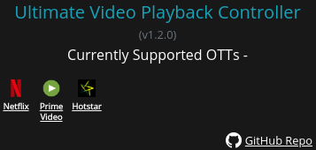

# Ultimate Video Playback Controller

A chrome extension to control playback rate for OTT platforms like -

- [x] Netflix,
- [x] Amazon Prime Video,
- [x] Hotstar, etc.

The extension can remember your last used playback speed, and automatically apply it the next time you open a video. In other words, while binge-watching shows, set a speed on 1 video.. the extension applies it for the rest!

It used the chrome.storage.sync API to do the same (which means it'll save the setting across ALL your devices with support for chrome extensions)
